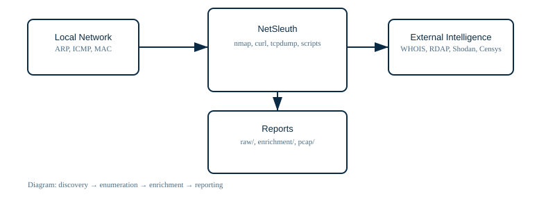
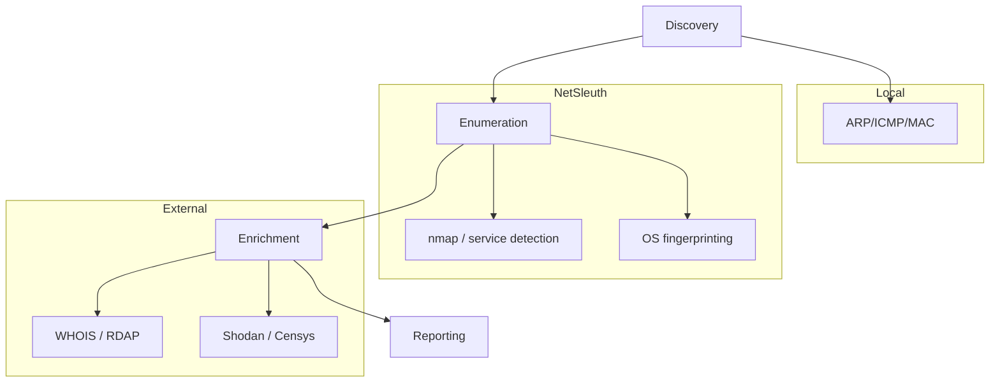

# NetSleuth

**Network Intelligence & Reconnaissance Toolkit**

NetSleuth is a focused, Bash-based network reconnaissance and IP intelligence toolkit built for authorized cybersecurity labs, defensive assessments, and network troubleshooting. Starting from an IP address, it collects observable data such as host availability, DNS, MAC/vendor information, TCP/UDP ports, services, OS clues, SMB/NetBIOS, SSH, HTTP/HTTPS, TLS, RDP, database endpoints, ASN/RDAP, GeoIP, traceroute, and optional external intelligence (Shodan, Censys).

Repository: https://github.com/vishal-ravi/NetSleuth.git

> Important: NetSleuth is intended only for systems and networks that you own or have explicit permission to assess. It does not perform password guessing, credential theft, authentication bypass, or exploitation.

---

## Quick Project Overview

- **Language:** Bash
- **Primary script:** `netsleuth.sh`
- **Repository:** https://github.com/vishal-ravi/NetSleuth.git
- **Intended platforms:** Kali, Debian, Ubuntu, Parrot OS, and other Linux distributions with compatible tooling

## Highlights

- Modular, script-first reconnaissance with graceful handling of missing optional tools
- Multiple scan profiles: `--quick`, `--deep`, `--all`, and `--passive`
- Optional enrichment from public intelligence sources (Shodan, Censys) when configured
- Optional packet capture (`tcpdump`) and organized `--report` output for auditing and analysis

## Quick Start

Clone and run the script:

```bash
git clone https://github.com/vishal-ravi/NetSleuth.git
cd NetSleuth
chmod +x netsleuth.sh
./netsleuth.sh --help
```

A compact example using a documentation IP (`203.0.113.42`):

```bash
./netsleuth.sh 203.0.113.42 --quick
sudo ./netsleuth.sh 203.0.113.42 --deep --report --install-deps
```

## Visual overview

Below is a compact visual summary of NetSleuth. The logo and architecture diagram are simple, scalable SVGs included in the repository for clarity and documentation.

Logo:


Architecture diagram:



### Generate PNG exports

If you'd like raster images (PNG) for README previews or distribution, run the included conversion script. It looks for `rsvg-convert` (recommended) or `convert` (ImageMagick).

Run:

```bash
# from repository root
bash tools/convert_svgs.sh
```

This writes PNG files alongside the SVGs (for example `assets/logo.png` and `assets/architecture.png`).

### Architecture flow (Mermaid)




## Features

NetSleuth provides modular reconnaissance capabilities. Major areas include:

- Network information: IP classification, host availability, ICMP latency, reverse DNS, ARP/neighbor info, MAC vendor lookup, TTL observations, traceroute.
- Port discovery: TCP top-port scanning, full TCP port scans (1–65535), UDP discovery, open/closed/filtered state detection, Nmap `--reason` output.
- Service fingerprinting: service name, product, version, protocol, banners, and service-specific data.
- OS detection: Nmap-based TCP/IP fingerprinting (estimates only).
- Windows / SMB: computer name, domain/workgroup, SMB versions, server time, NetBIOS when available.
- Web enumeration: HTTP title, server headers, methods, security headers, TLS certificate details, WhatWeb fingerprints (optional).
- TLS: certificate subject/issuer, serial, validity, fingerprint, supported TLS/ciphers when available.
- Other protocols: SSH, RDP, FTP, LDAP, SNMP, UPnP, mDNS, common databases, DNS.
- External intelligence: WHOIS, RDAP, ASN, GeoIP, Shodan (optional), Censys (optional).
- Packet capture: optional `tcpdump` capture saved as `.pcap` for Wireshark/tshark analysis.

## Requirements

NetSleuth expects a modern Linux environment. Recommended baseline:

- OS: Debian/Ubuntu/Kali/Parrot or similar
- RAM: 2 GB+ (4 GB recommended for comfortable operation)
- Storage: 2–10 GB depending on scans/reports
- Privileges: Some modes require root (`sudo`) for raw sockets, packet capture, SYN/UDP scans

Recommended packages (examples): `nmap`, `curl`, `whois`, `dig`, `tcpdump`, `openssl`, `nbtscan`, `whatweb`, `jq`.

## Installation

Clone or copy the project and make the main script executable:

```bash
git clone <YOUR_REPOSITORY>
cd NetSleuth
chmod +x netsleuth.sh
```

Check help output:

```bash
./netsleuth.sh --help
```

## Automatic Dependency Handling

NetSleuth includes a dependency pre-flight check. It distinguishes between required and optional tools and can optionally attempt to install missing packages.

To attempt automatic installation:

```bash
sudo ./netsleuth.sh 192.0.2.42 --all --install-deps
```

Supported package managers: `apt`, `dnf`, `yum`, `pacman`, `zypper`.

## Usage

Basic syntax:

```bash
./netsleuth.sh <IP> [OPTIONS]
```

Examples (using a documentation IP `203.0.113.42`):

Quick reconnaissance:

```bash
./netsleuth.sh 203.0.113.42 --quick
```

Comprehensive deep scan with report and dependency install:

```bash
sudo ./netsleuth.sh 203.0.113.42 --deep --report --install-deps
```

Full suite (includes external enrichment when available):

```bash
sudo ./netsleuth.sh 203.0.113.42 --all --report
```

Passive intelligence (no active port scanning):

```bash
./netsleuth.sh 203.0.113.42 --passive --report
```

Packet capture (requires `tcpdump` and usually root):

```bash
sudo ./netsleuth.sh 203.0.113.42 --pcap --report
```

## Common Options

- `--quick`   : Fast, lightweight reconnaissance (host discovery, top TCP ports, basic service detection)
- `--deep`    : Longer, thorough active scanning (OS, service details, UDP, SMB, many NSE scripts)
- `--all`     : Broad collection of modules plus optional external enrichment
- `--passive` : Passive/public intelligence (WHOIS, RDAP, GeoIP, Shodan/Censys if configured)
- `--udp`     : Enable UDP discovery
- `--web`     : Web-focused checks (HTTP/HTTPS endpoints, headers, TLS)
- `--smb`     : SMB/Windows-focused enumeration
- `--ssh`     : SSH host/key and algorithm inspection
- `--vuln`    : Run Nmap vulnerability NSE scripts (intrusive; authorized use only)
- `--pcap`    : Capture packets involving the target
- `--shodan`  : Query Shodan (requires `SHODAN_API_KEY` env var)
- `--censys`  : Query Censys (requires `CENSYS_API_TOKEN` env var)
- `--report`  : Save results into `reports/<IP>_TIMESTAMP/`
- `--install-deps`: Attempt to install missing dependencies automatically

## Report Layout

When `--report` is used, NetSleuth organizes outputs under `reports/<IP>_YYYYMMDD_HHMMSS/`:

- `raw/`         : Raw command outputs (host discovery, tcp/udp scans, service details, os, smb, web, tls, etc.)
- `enrichment/`  : WHOIS, RDAP, ASN, GeoIP, Shodan/Censys JSON or text files
- `pcap/`        : Captured `.pcap` files
- `README.txt`   : Short summary and list of skipped modules

## Sample Workflow

1. Start with a quick scan to validate reachability and basic services:

```bash
./netsleuth.sh 203.0.113.42 --quick
```

2. For deeper insight (run as root if needed):

```bash
sudo ./netsleuth.sh 203.0.113.42 --deep --report
```

3. Investigate specific services discovered (SMB, HTTP, SSH):

```bash
sudo ./netsleuth.sh 203.0.113.42 --smb --report
sudo ./netsleuth.sh 203.0.113.42 --web --report
```

4. If you want packet data, capture with `--pcap` and analyze with Wireshark:

```bash
wireshark reports/203.0.113.42_*/pcap/203.0.113.42.pcap
```

## Security & Legal Notice

NetSleuth is a reconnaissance tool. Do not use it against systems you do not own or do not have explicit authorization to test. Vulnerability scanning, packet capture, and exploitation attempts may be illegal or disruptive. Always obtain written permission where required.

### Recommended safe usage

- Use on local lab networks, VMs, and systems you control.
- Limit `--vuln` scans to controlled environments.
- Maintain logs and document authorization for audits.

## Contributing

Contributions, bug reports, and feature requests are welcome. Please open issues or pull requests in the repository. When contributing:

- Keep changes small and focused.
- Add tests or examples when applicable.
- Respect the project's licensing.

## Roadmap (ideas)

- JSON/SQLite output and history tracking
- HTML dashboard and visualization
- CVE and CPE correlation
- Authenticated Windows/Linux inventory modules
- Improved TLS/Certificate correlation and caching

